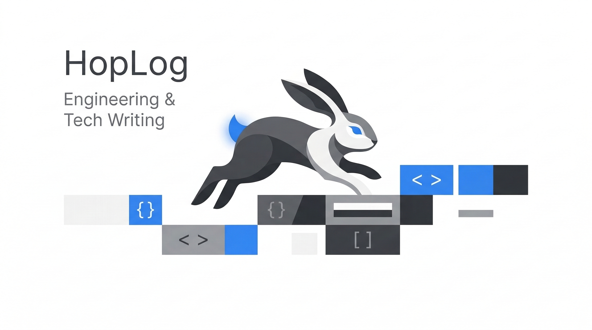

<p align="center">
  
</p>

# 🐰 HopLog

> **Recording the leaps of engineering.**
> A minimalist workspace for developers who value speed, depth, and the essence of software craftsmanship.

HopLog is a focused workspace for engineers built on Next.js 16 and Bun. It offers an ultra-fast developer experience, optimized SEO ("Engineering", "Software Architecture", "Minimalism"), and a distraction-free reading interface.

## Key Features

- **Performance First**: Built on Next.js 16 (App Router) and Tailwind CSS 4 for blazing fast load times.
- **Minimalist Aesthetics**: Clean, monochrome design with a "2% primary accent" philosophy.
- **Dynamic Branding**: Configure your site name, metadata, and even your favicon dynamically via `config.yml`.
- **Keyboard-Centric**: Built-in command palette (⌘+⇧+P) and global hotkeys for power users.
- **Git-Integrated Activity**: Real-time GitHub contribution sync and writing density visualization.

## Tech Stack

- **Framework**: Next.js 16 (React 19)
- **Styling**: Tailwind CSS 4 (OKLCH color space)
- **Runtime**: Bun
- **Content**: Markdown (remark/rehype)
- **State**: Zustand

## Getting Started

1.  **Clone the repository:**
    ```bash
    git clone https://github.com/rapidrabbit76/hoplog.git
    cd hoplog
    ```

2.  **Install dependencies:**
    ```bash
    bun install
    ```

3.  **Set up your profile:**
    ```bash
    cp content/profile.example.yml content/profile.yml
    ```
    Edit `content/profile.yml` to fill in your name, bio, social links, experience, and skills.

4.  **Run development server:**
    ```bash
    bun dev
    ```

5.  **Customize your brand & UI:**
    Edit `content/config.yml` for site metadata, hero banner, and branding.
    Edit `content/schemas.yml` to define unlimited dynamic Color Schemas for the site. Users can switch between these themes in real-time via the Command Palette (⌘+⇧+P).

## 📝 Writing Posts

Add your markdown files to the `content/posts/` directory. Each post should have the following frontmatter:

```yaml
---
title: "Your Post Title"
date: "YYYY.MM.DD"
category: ["Category1", "Category2"]
excerpt: "A brief summary of your post."
---
```

## 📜 License

MIT License. Feel free to use and contribute!
