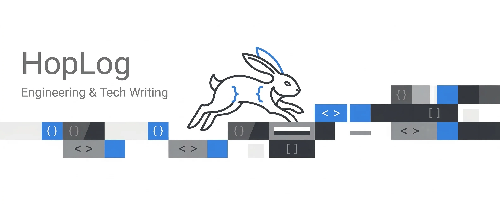

<p align="center">

</p>

<p align="center">
  <a href="README.md">English</a> · <a href="README.ko.md">한국어</a>
</p>

# 🐰 HopLog

> A simple blog built for developers.
> Fast to write in, easy to customize, and pleasant to read.

HopLog is a developer-friendly blog built with Next.js 16 and Bun. It focuses on the things developers actually care about: fast startup, markdown-based writing, keyboard-friendly navigation, clean theming, and straightforward customization.

It is also heavily inspired by the simplicity of Jekyll-style blogging: file-based posts, frontmatter-driven content, and a workflow that feels natural to developers.

## ✨ Key Capabilities

- **Fast by Default**: Built on Next.js 16 (App Router) and Tailwind CSS 4 for quick load times and a responsive editing/viewing experience.
- **Clean Blog UI**: A simple visual style that keeps attention on your posts instead of the chrome around them.
- **Category-Aware Post Feed**: The home page filters posts by category and loads additional pages incrementally via `/api/posts`.
- **Recursive Content Routing**: Nested markdown files under `content/posts/` automatically map to nested `/posts/...` routes.
- **Keyboard-First Navigation**: Built-in command palette (⌘+⇧+P) and global hotkeys for seamless navigation.
- **Git-Integrated Activity**: Real-time GitHub contribution sync and writing density visualization.
- **Private Post Support**: Hide drafts or internal notes from routes, metadata, and sitemaps using frontmatter flags.
- **Multilingual UI**: Interface translations are available for English, Korean, Japanese, and Chinese.

## 🚀 Quick Start

1. **Clone the repository**
   ```bash
   git clone https://github.com/rapidrabbit76/hoplog.git
   cd hoplog
   ```

2. **Install dependencies**
   ```bash
   bun install
   ```

3. **Configure your profile**
   ```bash
   cp content/profile.example.yml content/profile.yml
   ```
   Edit `content/profile.yml` to set your name, bio, social links, experience, and skills.

4. **Launch development server**
   ```bash
   bun dev
   ```

## 📝 Writing Content

Add your markdown files anywhere under `content/posts/`. HopLog supports deep nesting, making it easy to organize tutorials and series.

**Examples:**
- `content/posts/getting-started.md` → `/posts/getting-started`
- `content/posts/tutorial/advanced.md` → `/posts/tutorial/advanced`

### Post Metadata (Frontmatter)

Each post uses YAML frontmatter for configuration:

```yaml
---
title: "Your Post Title"
date: "2026.03.11"
category: ["Engineering", "Architecture"]
excerpt: "A brief summary for SEO and lists."
image: "/api/images/cover.jpg" # Optional cover image
fontFamily: "'Noto Sans KR', sans-serif" # Optional custom font
fontUrl: "https://fonts.googleapis.com/css2?family=Noto+Sans+KR&display=swap" # Optional font link
visibility: "private" # Optional: set to 'private' to hide post
---
```

### Private Posts
Use `visibility: "private"` to hide a post from the public site (lists, sitemaps, metadata, and direct access).

`public: false` is also supported for compatibility with older content, but `visibility: "private"` is the recommended format going forward.

## 🎨 Customization & Branding

### Site Configuration
Edit `content/config.yml` to manage site-wide metadata, hero content, typography, and title templates. Root SEO settings are managed in `content/seo.yml`.

You can also enable `ga`, `metaPixel`, and `sentry` from `content/config.yml`. Each provider has its own `enabled` flag, so you can turn them on or off independently. Provider values are resolved from env vars such as `GA_MEASUREMENT_ID`, `META_PIXEL_ID`, and `SENTRY_DSN`.

### Post Sharing
Post pages render an icon-only sharing row at the bottom of each article when `sharing:` in `content/config.yml` contains at least one provider. The array order controls button order.

`copyLink` copies the current URL and briefly swaps its icon to a check mark for feedback.

Supported providers are:
- `twitter`
- `facebook`
- `linkedin`
- `copyLink`

### Optional Meilisearch
HopLog always has a built-in local search path. The bundled `content/config.yml` is prewired for Meilisearch, but search still falls back to local title/excerpt matching until the required host/key env vars are available. To use Meilisearch fully, keep `search.provider` as `meilisearch` in `content/config.yml`, configure `MEILISEARCH_HOST`, `MEILISEARCH_SEARCH_KEY`, and `MEILISEARCH_ADMIN_KEY`, then run `bun run search:sync` to publish your posts into the configured index.

### Dynamic Themes
Define themes as individual YAML files in `content/themes/`. They are loaded automatically and exposed in the Command Palette (⌘+⇧+P).

### UI Localization
Interface strings are isolated in `messages/*.json` files. This allows for easy translation without touching the application logic. Supported locales include:
- `en` (English)
- `ko` (Korean)
- `ja` (Japanese)
- `zh` (Chinese)

For a guided walkthrough, see the tutorial posts under `content/posts/tutorial/`.

- Analytics setup tutorial: `/posts/tutorial/site-configuration`

## 🔎 Technical Details

- **Metadata Generation**: Automatically generates `sitemap.xml` and `robots.txt`.
- **Custom Error Pages**: Dedicated `404` and `500` experiences are included.
- **Media Support**: Images can be served via the `/api/images/[...path]` endpoint.
- **Tech Stack**: Next.js 16 (React 19), Tailwind CSS 4 (OKLCH), Bun, Zustand, and Remark/Rehype.

## 🐳 Docker

### Quick Start

```bash
docker compose up -d
```

On first run, a `blog/` directory is created and seeded with default content (posts, themes, config, FAQ). Edit files in `blog/` to customize your site. On subsequent runs, existing content is preserved.

`profile.yml` is not included in the image. If missing, it is automatically created from `profile.example.yml` at startup.

### Environment Variables

All variables are optional and read at runtime — no image rebuild needed to change them.

| Variable | Description |
| :--- | :--- |
| `GA_MEASUREMENT_ID` | Google Analytics measurement ID |
| `META_PIXEL_ID` | Meta Pixel ID |
| `SENTRY_DSN` | Sentry DSN |
| `SENTRY_ENVIRONMENT` | Sentry environment name |

### Optional: Meilisearch

Search works out of the box with a built-in local index. Meilisearch is **not required**.

To enable it:

```bash
docker compose --profile search up -d
```

Then set `search.provider` to `meilisearch` in `blog/config.yml` and sync:

```bash
docker compose exec app bun run search:sync
```

When using Meilisearch, these additional variables apply:

| Variable | Description |
| :--- | :--- |
| `MEILISEARCH_HOST` | Meilisearch endpoint URL |
| `MEILISEARCH_SEARCH_KEY` | Public search key |
| `MEILISEARCH_ADMIN_KEY` | Admin key |

## 🛠 Commands

| Command | Description |
| :--- | :--- |
| `bun dev` | Start the development server |
| `bun run lint` | Run ESLint checks |
| `bun run build` | Create a production build |
| `bun start` | Start the production server |
| `bun run test:unit` | Run unit tests (Vitest) |
| `bun run test:e2e` | Run end-to-end tests (Playwright) |
| `bun run search:sync` | Sync posts to Meilisearch index |
| `bun run import:velog -- <username>` | Import posts from Velog |

## 📜 License

Licensed under the [MIT License](LICENSE). Contributions are welcome!
